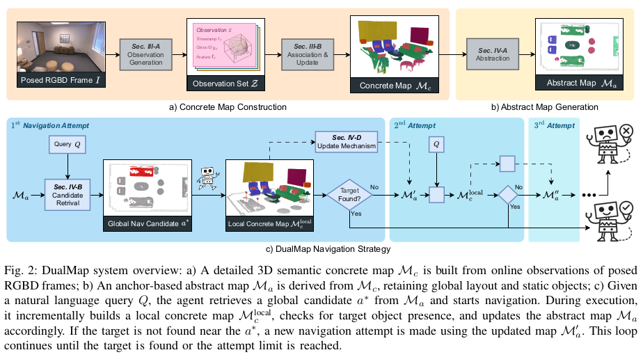

## dualmap

This module provides open semantic mapping and generates navigation paths for robot navigation.

to be considered earlier, may extend support for UAV bird-eye view mappings, where the depth should be replaced with height or other representation.