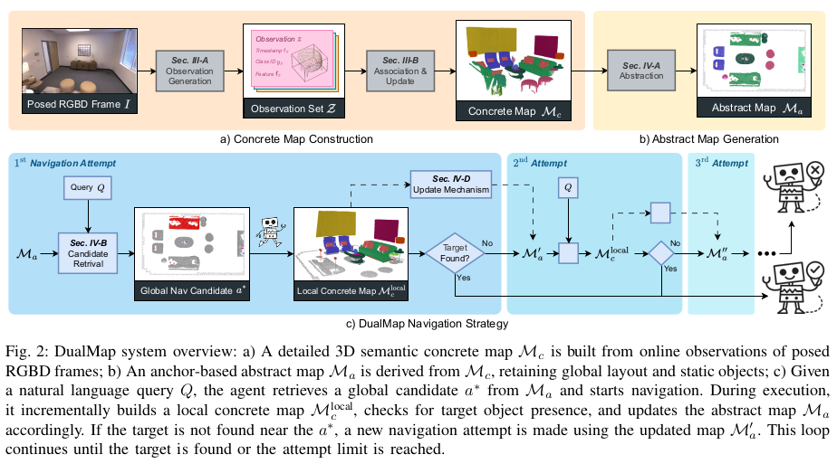

## dualmap

This module provides open vocabulary mapping and generates navigation paths for robot navigation.

migrated and modified from DualMap:


This module is the heaviest process of the agent, using ROS2 to obtain RGB-D and pose topics from the deployment env

### Usage
Original detailed usage instructions and examples can refer to [DualMap](https://github.com/Eku127/DualMap?tab=readme-ov-file#applications).

#### Online Interactive Mapping
Before running, configure the following YAML file:

[system_config.yaml](config/system_config.yaml)
```yaml
# Choose or create the appropriate class list depending on the scene:
# These classes would be used for yolov8l-world open-vocabulary zero-shot detection
given_classes_path: ./config/class_list/gpt_outdoor_general.txt
```

[base_config.yaml](config/base_config.yaml)
```yaml
# set the rgbd sensor intrinsics
dataset_name: 'carla'
ros_topics:
  rgb: "/camera/rgb/image_raw"
  depth: "/camera/depth/image_raw"
  odom: "/camera/pose"
  camera_info: "/camera_info"
intrinsic:
  fx: 640
  fy: 640
  cx: 320
  cy: 240
# extrinsics:
#   [1, 0, 0, 0, 
#   0, 1, 0, 0, 
#   0, 0, 1, 0,
#   0, 0, 0, 1]
```

### Note
to be considered earlier, may extend support for UAV bird-eye view mappings, where the depth should be replaced with height or other representation.