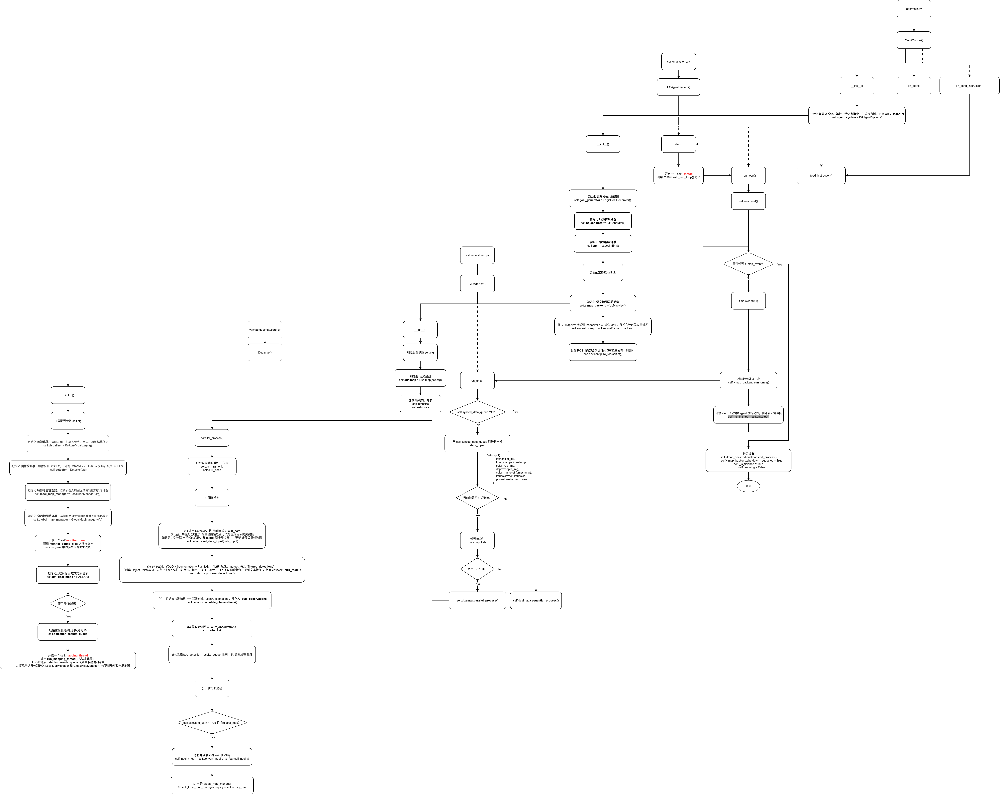

# EmbodiedGenAgent
A Generative Embodied Agent that transforms open-ended instructions into behavior trees for autonomous decision-making and action execution loop

## Architecture (continuing)

## Usage
- GUI demo: [APP.md](docs/APP.md). Need EGAgentSystem as backend, which should be implemented its deployment env, check [envs](EG_agent/system/envs)

- Agent introduction: [EG_agent.md](docs/EG_agent.md)

- Agent module unit test: [EXAMPLES.md](docs/EXAMPLES.md)

- Agent system isaacsim deployment: [SIMULATION.md](docs/SIMULATION.md), an well-explained example of the envs impl

## Plans
- [x] Implement the intent understanding: vlm prompt / reflective feedback to generate the first-order logic goal
- [x] Wrap the bt tree generator to generate executable bt from the first-order logic goal
- [x] Implement the Isaaclab simulator, scene usd, robot and its locomotion policy and sensor configuration
- [x] ROS bridge between the Isaacsim5 and ROS2
- [x] Testing dualmap mapping with Isaacsim env 
- [ ] Define and implement the atomic actions and conditions to connect agent and simulator
- [ ] Wrap the online open-vacabulary object/place querying
- [ ] Implement the path planner and cmd_vel controller
- [ ] Enhance the prompts engineering with memory / map for better reasoning and interactive task
- [ ] Usage examples for EG_system running in simulator
- [x] An interactive GUI to demo
- [ ] The frontier exploration navigator for task-oriented exploration

## Dependencies
EG_agent:
- Python == 3.10 (to use the released rclpy without rebuilding ROS2’s non-py310 bindings)
- see [requirements.txt](requirements.txt)

to deploy and test EG_agent in simulation:
- Python >= 3.11 (use a ZMQ ros bridge to connect with EG_agent)
- [IsaacSim](https://docs.isaacsim.omniverse.nvidia.com/5.0.0/installation/install_python.html) == 5.0.0
- [IsaacLab](https://isaac-sim.github.io/IsaacLab/v2.2.1/source/setup/installation/pip_installation.html) == 2.2.1

## Acknowledgments
- Prompts for well-formed first-order logic goal prompts modified from: https://github.com/HPCL-EI/RoboWaiter.git
- BehaviorTree generator modified from: https://github.com/DIDS-EI/BTPG.git
- Object/Place querying in the unkown world using open-vocabulary mapping: https://github.com/Eku127/DualMap.git
- Simulator: https://github.com/isaac-sim/IsaacLab.git