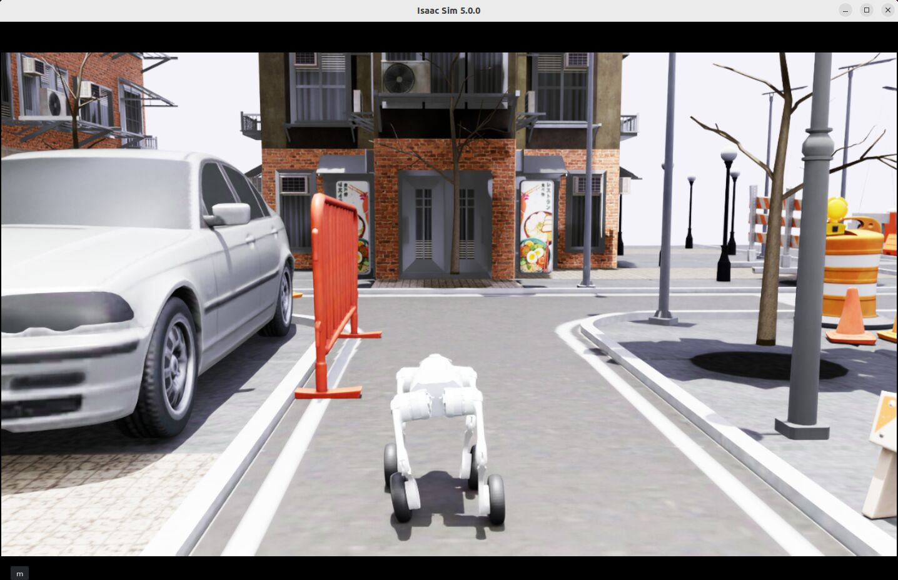
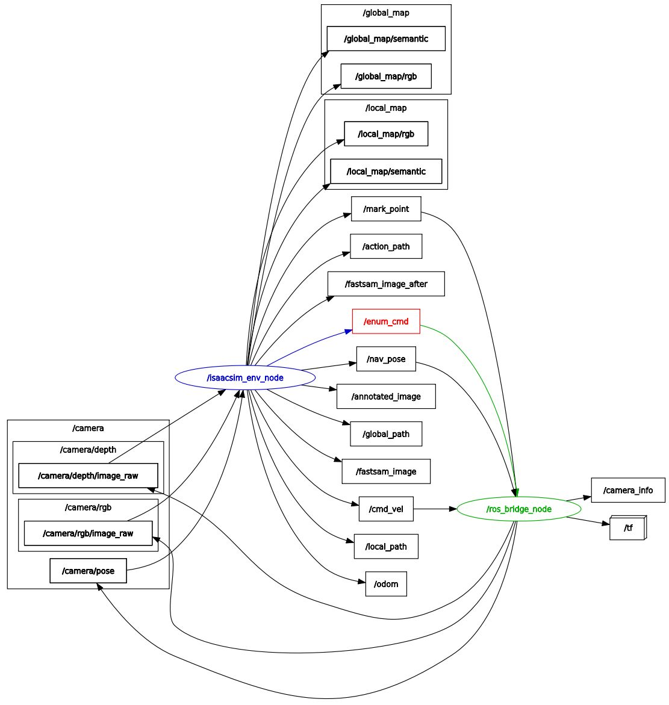

# EmbodiedGenAgent
A Generative Embodied Agent that transforms open-ended instructions into behavior trees for autonomous decision-making and action execution loop

## Dependencies
EG_agent:
- Python == 3.10 (to use the released rclpy without rebuilding ROS2’s non-py310 bindings)
- see [requirements.txt](requirements.txt)

To deploy and test EG_agent in simulation:
- Python >= 3.11 (use a ZMQ ros bridge to connect with EG_agent)
- [IsaacSim](https://docs.isaacsim.omniverse.nvidia.com/5.0.0/installation/install_python.html) == 5.0.0
- [IsaacLab](https://isaac-sim.github.io/IsaacLab/v2.2.1/source/setup/installation/pip_installation.html) == 2.2.1

## Usage
- GUI demo: [APP.md](docs/APP.md), need EGAgentSystem as backend, where should implement its deployment details, check [envs](EG_agent/system/envs)

- Agent introduction: [EG_agent.md](docs/EG_agent.md)

- Agent module unit test: [EXAMPLES.md](docs/EXAMPLES.md)

- Agent system isaacsim deployment: [SIMULATION.md](docs/SIMULATION.md), a detailed example of the env implementation

### Guide
After reading the guides above, follow these steps for the Isaac Sim demo:
| Environment | Command | Description | Preview |
|-------------|---------|-------------|---------|
| Python 3.10 (Agent + GUI) | `python app/main.py` | Launch the Agent and GUI. The system waits for ROS2 topics: `/camera/rgb/image_raw`, `/camera/depth/image_raw`, `/camera_pose`, `/camera_info` (optional), and creates ROS2 publishers: `/cmd_vel`, `/mark_point`, `/enum_cmd`, etc. |  |
| Python 3.11 (IsaacSim 5.0) | `python simulation/run_demo.py` | Start the simulation environment. |  |
| Python 3.10 (Bridge; can share with Agent env) | `python simulation/ros_bridge.py` | Start the data bridge between IsaacSim and ROS2, only needed for this ros2 incompatible env. |  |

And then in the GUI:
- **创建后台**: 点击`创建后台`按钮，创建具身建图后台，用于智能体理解世界,对齐指令目标和地图实体
- **智能体开始工作**: 点击`启动智能体`按钮，智能体和部署环境开始通信，本例`IsaacSim`通信使用`ROS2`
- **载入地图（可选）**: 点击`载入地图`按钮，选择预建地图目录
- **发送指令**: 在输入框中输入指令，点击`发送`按钮。任务目标会自动提取，请发送和场景有关的指令，若为场景无关指令，则可能会在对话窗口提示指令失败。解析和规划成功后，会在行为树窗口可视化执行行为树，机器人自动开始执行。
- **原子动作**：目前指令可解析的原子动作包括`目标搜寻（Find）`、`目标移动（Walk）`、`拍摄存图（Capture）`、`插旗标记（Mark）`、`生成报告（Report）`。如需更多指令，需自行在待部署机器人中实现并在[`env`](EG_agent/environment/embodied)中添加注册，补全对应的动作、条件节点。

## Plans
Base Version:
- [x] Implement the `reasoning` module for intent understanding: vlm prompt / reflective feedback to generate the first-order logic goal
- [x] Implement the `planning` module by wrapping the bt tree generator to generate executable bt from the first-order logic goal
- [x] Implement the `simulator` by IsaacLab, scene usd, robot and its locomotion policy and sensor configuration
- [x] ROS bridge between the Isaacsim5 and ROS2
- [x] Implement the `vlmap` module migrated from dualmap as a embodied backend
- [x] Implement the `environment` module, define and implement the atomic actions and conditions to connect agent and simulator
- [x] Implement the `system` module, which integrates the above modules and scheduling the execution logic
- [x] Implement the `system.envs` module, which integrates the necessary deployment funtion APIs like path planner and cmd_vel controller
- [x] An interactive GUI `app` to demo, providing real-time visualization of key system information such as the global semantic map, behavior tree, planned paths and etc.

Future Work:
- [ ] Enhance the prompts engineering with memory / map for better reasoning and interactive task
- [ ] Support user-defined object classes in the GUI window, and some preset scene classes templates
- [ ] More scenes in the Isaacsim simulator
- [ ] The frontier self-exploration navigator for `Find` action when target not found
- [ ] Conitune dev and opt the vlmap backend, adding support for additional range sensors beyond the depth camera
- [ ] Real world deployment with a legged robot

## Acknowledgments
- Prompts for well-formed first-order logic goal prompts modified from: https://github.com/HPCL-EI/RoboWaiter.git
- BehaviorTree generator modified from: https://github.com/DIDS-EI/BTPG.git
- Object/Place querying in the unkown world using open-vocabulary mapping: https://github.com/Eku127/DualMap.git
- Simulator: https://github.com/isaac-sim/IsaacLab.git
- Go2W locomotion policy from: https://github.com/VisionTrekker/legged-loco