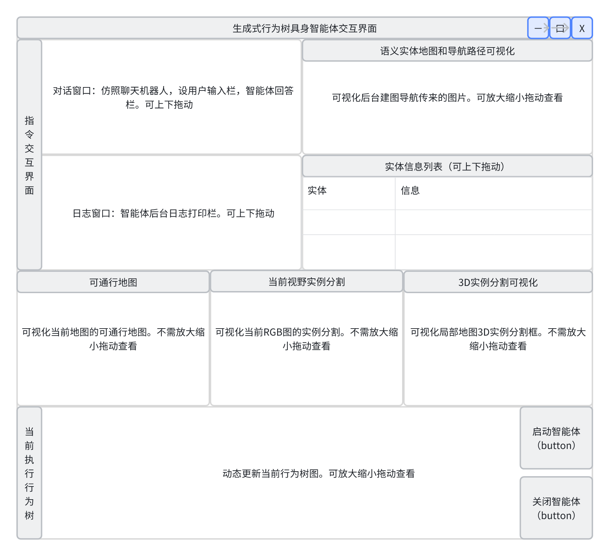

# Application
- the user interface to interact with the agent
- runtime visualization of map, instance, behavior_tree, ... 

### Build prompts

> 我要写一个 生成式行为树具身智能体 的用户交互界面，请参考我给的界面设计图 gui_design.png，和别人写的一个PyQt5界面代码 window.py 和 window.ui，基于这两个文件，修改和完善成我的界面代码，确保界面和设计图一致。

> 功能上，我的智能体是由这个 system.py 中的 EGAgentSystem 类来控制的，界面的启动和停止按钮控制智能体的运行。然后给我增加实现界面所需各种交互功能，在和window.py、window.ui一个目录目录下，新增功能实现的文件，太多的话可以分不同文件不同模块写。然后有需要的话完善我的 EGAgentSystem 类以满足要求。界面所需的各种图像、文字、列表等信息，可以都给我先在 EGAgentSystem 预留接口，等我后续自行补上。最后按你的理解，差异化各个小窗信息的更新频率，并美化界面。