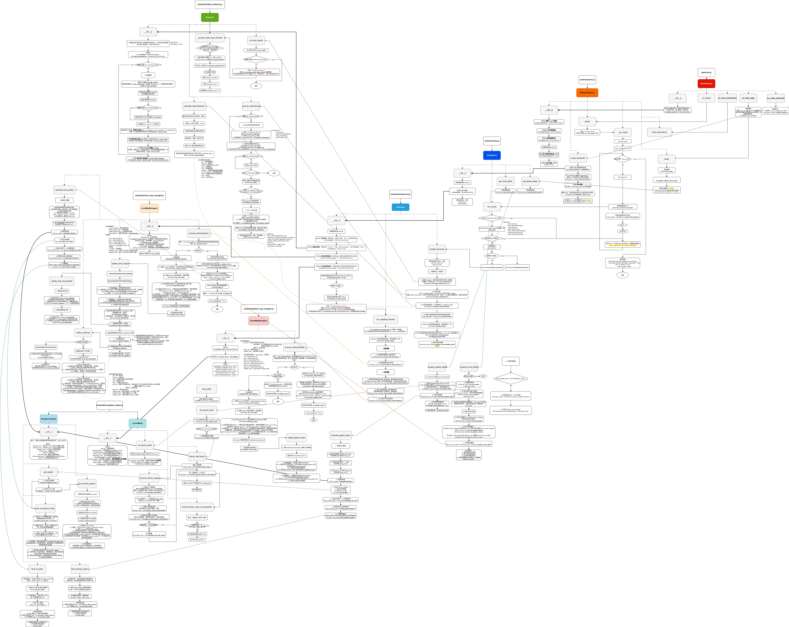

# EG_agent
### system introduction
- TODO: to complete

### module introduction
- [environment](../EG_agent/environment/ENVIRONMENT.md)
- [vlmap](../EG_agent/vlmap/VLMAP.md)
- [reasoning](../EG_agent/reasoning/REASONING.md)
- [planning](../EG_agent/planning/PLANNING.md)
- [prompts](../EG_agent/prompts/PROMPTS.md)
- [system](../EG_agent/system/SYSTEM.md)

### architecture (continuing)

