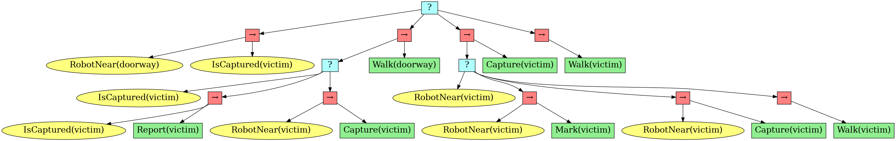
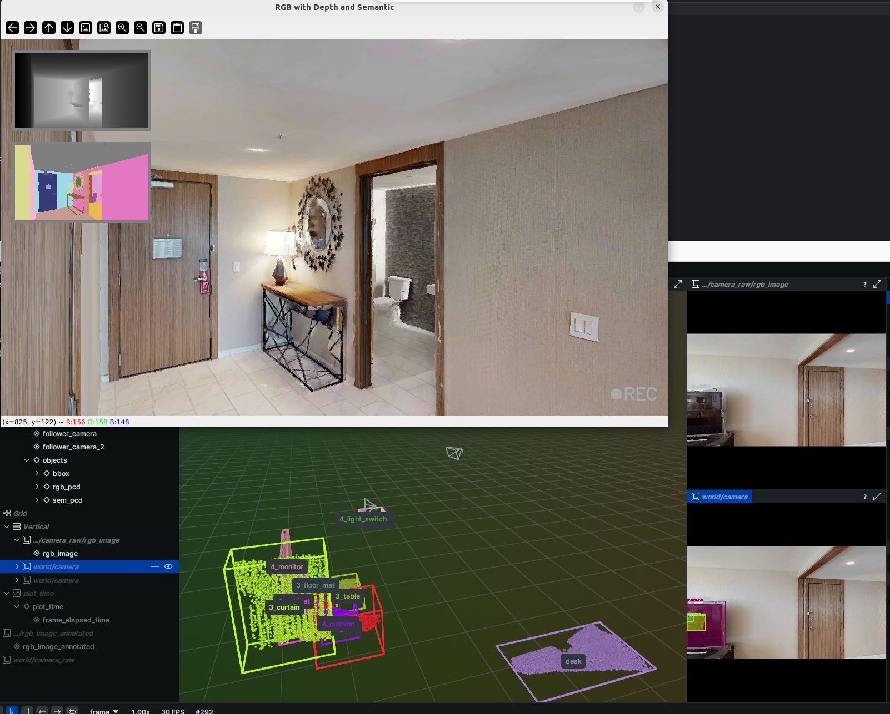
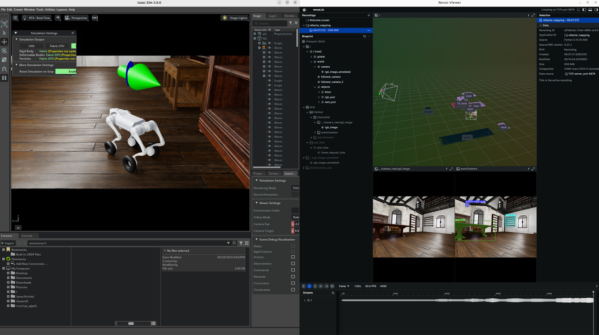
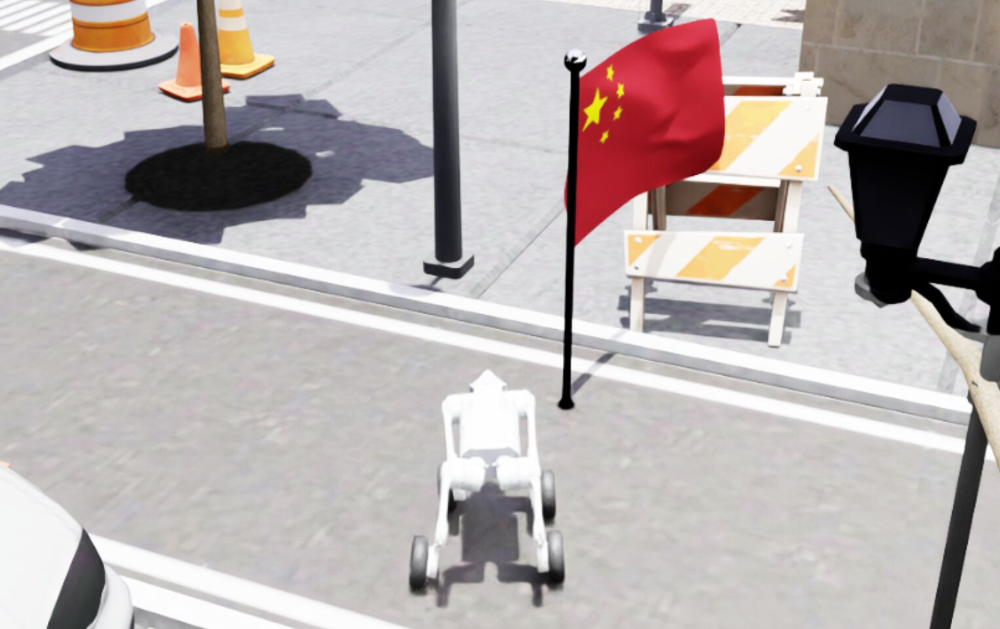

### test goal_infer
`python -m examples.goal_infer`
```shell
[Info] Instruction: Instruction: "请前往控制室。"
2025-09-12 11:27:14 - INFO - httpx - HTTP Request: POST http://127.0.0.1:8000/v1/chat/completions "HTTP/1.1 200 OK"
2025-09-12 11:27:14 - INFO - vlm_inference - LLM latency 0.34s
[Info] Sample #0 Attempt 1 Answer: RobotNear_ControlRoom
[Info] Instruction: Instruction: "请在仓库标记异常设备。"
2025-09-12 11:27:14 - INFO - httpx - HTTP Request: POST http://127.0.0.1:8000/v1/chat/completions "HTTP/1.1 200 OK"
2025-09-12 11:27:14 - INFO - vlm_inference - LLM latency 0.21s
[Info] Sample #1 Attempt 1 Answer: IsMarked_Equipment
[Info] Instruction: Instruction: "拍摄并报告楼梯口的烟雾源。"
2025-09-12 11:27:15 - INFO - httpx - HTTP Request: POST http://127.0.0.1:8000/v1/chat/completions "HTTP/1.1 200 OK"
2025-09-12 11:27:15 - INFO - vlm_inference - LLM latency 0.38s
[Info] Sample #2 Attempt 1 Answer: IsCaptured_SmokeSource & IsReported_SmokeSource
[Info] Instruction: Instruction: "请在出口处救援受困人员。"
2025-09-12 11:27:15 - INFO - httpx - HTTP Request: POST http://127.0.0.1:8000/v1/chat/completions "HTTP/1.1 200 OK"
2025-09-12 11:27:15 - INFO - vlm_inference - LLM latency 0.31s
[Info] Sample #3 Attempt 1 Answer: RobotNear_Doorway & IsReported_Victim
[Info] Instruction: Instruction: "请报告房间A的水泄漏情况。"
2025-09-12 11:27:15 - INFO - httpx - HTTP Request: POST http://127.0.0.1:8000/v1/chat/completions "HTTP/1.1 200 OK"
2025-09-12 11:27:15 - INFO - vlm_inference - LLM latency 0.49s
[Info] Sample #4 Attempt 1 Answer: RobotNear_RoomA & IsCaptured_WaterLeak & IsReported_WaterLeak
[Info] Instruction: Instruction: "请报告房间A的水泄漏情况。"
2025-09-12 11:27:16 - INFO - httpx - HTTP Request: POST http://127.0.0.1:8000/v1/chat/completions "HTTP/1.1 200 OK"
2025-09-12 11:27:16 - INFO - vlm_inference - LLM latency 0.36s
[Info] Sample #4 Attempt 2 Answer: IsCaptured_WaterLeak & IsReported_WaterLeak
[Info] Instruction: Instruction: "请前往大厅或充电站。"
2025-09-12 11:27:16 - INFO - httpx - HTTP Request: POST http://127.0.0.1:8000/v1/chat/completions "HTTP/1.1 200 OK"
2025-09-12 11:27:16 - INFO - vlm_inference - LLM latency 0.29s
[Info] Sample #5 Attempt 1 Answer: RobotNear_Lobby | RobotNear_ChargingStation
...
```


### test bt_gen
`python -m examples.bt_gen`



### test vlmap ros2 runner
`python -m examples.vlmap_run.py`
- This module requires ros2 rgb, depth and odom topics, you can either use [habitat-simulator-collector](https://github.com/Eku127/habitat-data-collector.git) or [isaacsim-simulator](SIMULATION.md) to test. Turn on the use_rerun visualizer:  (you can also use the rviz2 visualizer from [rviz2_config](../EG_agent/system/system_vis.rviz))

|  |  |
|:---------------------------------------------------------------------:|:-----------------------------------------------------------------:|
| Habitat 仿真                                                      | Isaac 仿真                                                    |

**Note**: not intended to deploy the agent in habitat-simulator, because it is rather a high-level simulator, sim2real gap would be huge

- after end_process, the global map will be saved and the timing statistics will be printed:
```shell
INFO:EG_agent.vlmap.utils.object_detector:[Detector][Layout] Saving layout to: /home/lenovo/Projects/GenAgent/EG_agent/vlmap/./outputs/map_results/carla/map/layout.pcd
INFO:EG_agent.vlmap.utils.time_utils:
Dualmap Timing Results:
INFO:EG_agent.vlmap.utils.time_utils:+------------------------+----------------+-----------------------+
| Step                   |   Avg Time (s) |   90th Percentile (s) |
+========================+================+=======================+
| Time Per Frame         |         0.2805 |                0.3965 |
+------------------------+----------------+-----------------------+
| Observation Generation |         0.2785 |                0.3944 |
+------------------------+----------------+-----------------------+
| Process Detection      |         0.2621 |                0.3627 |
+------------------------+----------------+-----------------------+
| Save Detection         |         0.0001 |                0.0001 |
+------------------------+----------------+-----------------------+
| Observation Formatting |         0.0163 |                0.0296 |
+------------------------+----------------+-----------------------+
| Local Mapping          |         0.0468 |                0.106  |
+------------------------+----------------+-----------------------+
| Global Mapping         |         0.0001 |                0.0001 |
+------------------------+----------------+-----------------------+
| Merging                |         0      |                0      |
+------------------------+----------------+-----------------------+
INFO:EG_agent.vlmap.utils.time_utils:
Timing results saved to /home/lenovo/Projects/GenAgent/EG_agent/vlmap/./outputs/map_results/carla/map/../system_time.csv
INFO:EG_agent.vlmap.utils.time_utils:
Detector Timing Results:
INFO:EG_agent.vlmap.utils.time_utils:+-------------------------------+----------------+-----------------------+
| Step                          |   Avg Time (s) |   90th Percentile (s) |
+===============================+================+=======================+
| Detection Filter              |         0.0549 |                0.0963 |
+-------------------------------+----------------+-----------------------+
| YOLO+Segmentation+FastSAM     |         0.0811 |                0.1183 |
+-------------------------------+----------------+-----------------------+
| YOLO                          |         0.0349 |                0.0495 |
+-------------------------------+----------------+-----------------------+
| Segmentation                  |         0.046  |                0.0798 |
+-------------------------------+----------------+-----------------------+
| CLIP+Create Object Pointcloud |         0.1017 |                0.1197 |
+-------------------------------+----------------+-----------------------+
| Create Object Pointcloud      |         0.0836 |                0.1037 |
+-------------------------------+----------------+-----------------------+
| CLIP                          |         0.101  |                0.1166 |
+-------------------------------+----------------+-----------------------+
| Visualize Detection           |         0.0229 |                0.042  |
+-------------------------------+----------------+-----------------------+
```

### test simulation env receiving ROS2 command topics
Publish cmd_vel (10 Hz), then stop:
```shell
ros2 topic pub /cmd_vel geometry_msgs/msg/Twist "{linear: {x: 2.0, y: 0.0, z: 0.0}, angular: {x: 0.0, y: 0.0, z: -1.0}}" -r 10
# stop
ros2 topic pub /cmd_vel geometry_msgs/msg/Twist "{linear: {x: 0.0, y: 0.0, z: 0.0}, angular: {x: 0.0, y: 0.0, z: 0.0}}" --once
```
Publish nav_pose (PoseStamped) once
```shell
ros2 topic pub /nav_pose geometry_msgs/msg/PoseStamped "{
  header: {frame_id: map},
  pose: {
    position: {x: 1.0, y: 2.0, z: 0.0},
    orientation: {x: 0.0, y: 0.0, z: 0.7071, w: 0.7071}
  }
}" --once
```
Publish enum_cmd (0: Capture, 1: Mark, 2: Report):
```shell
# Capture
ros2 topic pub /enum_cmd std_msgs/msg/Int32 "{data: 0}" --once
# Mark
ros2 topic pub /enum_cmd std_msgs/msg/Int32 "{data: 1}" --once
# Report
ros2 topic pub /enum_cmd std_msgs/msg/Int32 "{data: 2}" --once
```
- Mark action would place a flag in front of the robot:
